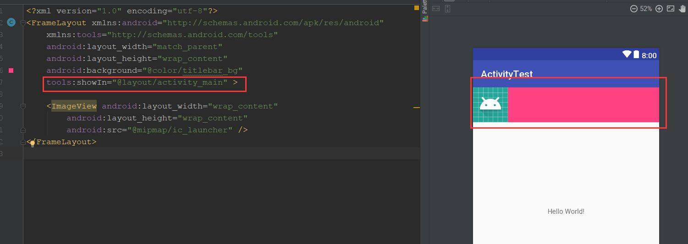
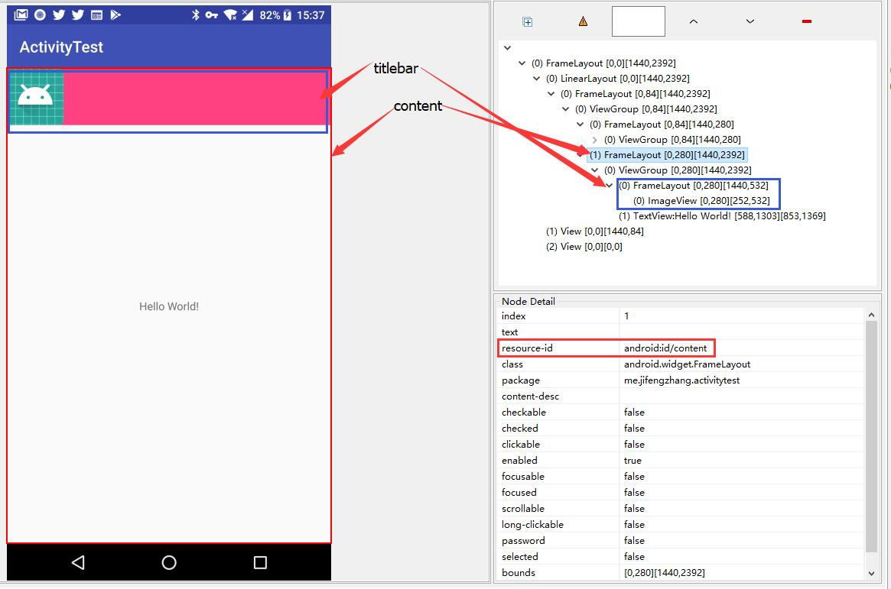
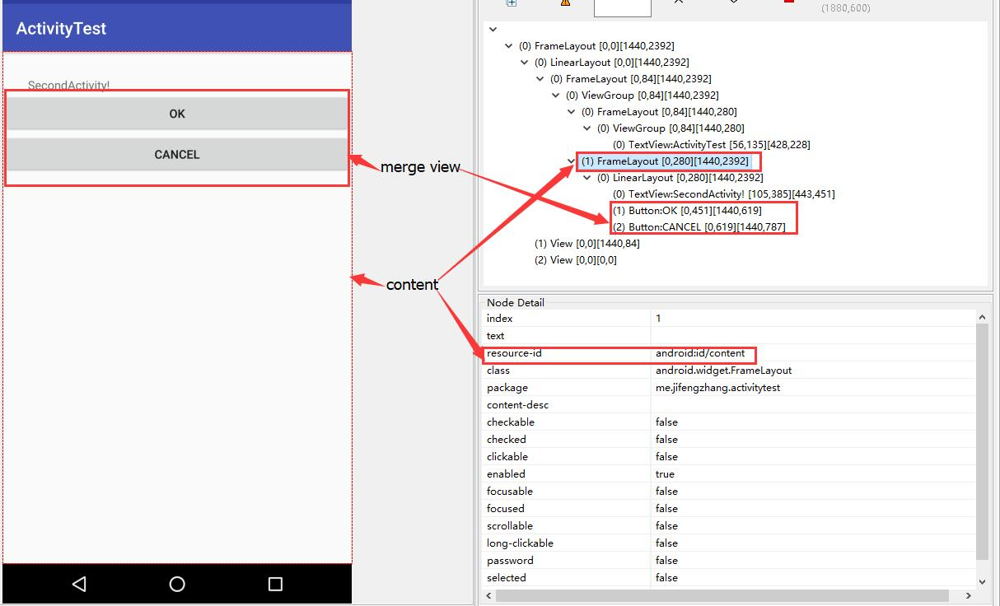
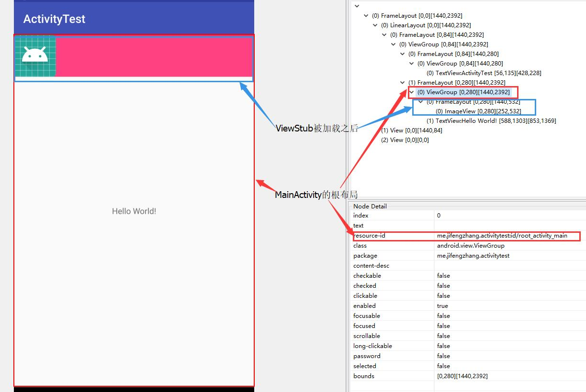

本篇是对官方文档的简单翻译，英文水平好的建议看原文 [官方文档链接](https://developer.android.com/training/improving-layouts/reusing-layouts.html#Include)

## 通过 < include / > 重用布局
虽然 Android 提供了众多的 widget 来给小型的和可重用的交互使用，但你仍然有一些需求是需要使用特殊布局的较大组件。为了更加有效的重复使用完整的特殊布局，你可以使用 < inculde /> 和 < merge />标签在当前布局中嵌入另一个布局。

重用布局功能强大，它允许你创建可重复使用的复杂布局。例如，一个“是/否”按钮面板，或包含描述文本的自定义进度条。这也意味着你的应用程序中在多个布局共有的任何元素都可以提取出来单独管理，然后包含在各个布局中。

### 创建一个可重复使用的布局
如果你已经知道这个布局需要重复使用，那么新建一个 xml 文件然后定义这个布局。举个例子，这个布局内容是定义一个 title bar，然后可以被每个 activity 包含使用( titlebar.xml ):
```xml
<FrameLayout xmlns:android="http://schemas.android.com/apk/res/android"
    xmlns:tools="http://schemas.android.com/tools"
    android:layout_width="match_parent"
    android:layout_height="wrap_content"
    android:background="@color/titlebar_bg"
    tools:showIn="@layout/activity_main" >

    <ImageView android:layout_width="wrap_content"
               android:layout_height="wrap_content"
               android:src="@drawable/gafricalogo" />
</FrameLayout>
```
根视图应该可以适配需要用到的每个布局，可以在每个布局中正常展示。

**Note**：tools:showIn 是一个特殊的属性，它仅仅在 AndroidStudio 的 design-time 使用，当编译的时候会被 remove 掉。它的作用是指定一个布局来包含当前视图，这样你可以通过 AndroiStudio 的预览功能看到嵌入后的效果。

### 使用< include > 标签
在需要添加可重用组件的布局中添加 < include /> 标签。例如，这里是一个包含标题栏的布局：

下面是布局文件的内容:
```xml
<LinearLayout xmlns:android="http://schemas.android.com/apk/res/android"
    android:orientation="vertical"
    android:layout_width="match_parent"
    android:layout_height="match_parent"
    android:background="@color/app_bg"
    android:gravity="center_horizontal">

    <include layout="@layout/titlebar"/>

    <TextView android:layout_width="match_parent"
              android:layout_height="wrap_content"
              android:text="@string/hello"
              android:padding="10dp" />

    ...

</LinearLayout>
```
你可以通过在 < include /> 标签中指定被包含布局的根视图的所有 layout 属性( android:layout_* 属性)。
```xml
<include android:id="@+id/news_title"
         android:layout_width="match_parent"
         android:layout_height="match_parent"
         layout="@layout/title"/>
```
但是，如果你需要在< include /> 标签里面设置布局属性，你必须同时设置 androi:layout_height 和 android:layout_width 才能使其他布局属性起作用。



**Note：<font color=red>需要在 layout_main 中添加 include 标签</font>**

运行之后的布局结果



### 使用 < merge > 标签
当在一个布局中包含另一个布局时，< merge /> 标签有助于消除视图结构中的冗余视图组( ViewGroup )。举个栗子，如果你的主布局时一个垂直的 LinearLayout, 子布局是两个可重用的视图，但可重用的子视图都有一个自己的根布局(如上一节提到的可重用布局都需要一个根布局)；然而使用另一个 LinearLayout 作为可重用布局的根视图，将导致在垂直的 LinearLayout 中直接包含另一个垂直的 LinearLayout。嵌套的 LinearLayout 除了会拖慢 UI 性能之外别无其他用途。

为了避免包含上面所说的冗余的视图组，你可以使用 < merge >标签作为可重用布局的根视图。
```xml
<merge xmlns:android="http://schemas.android.com/apk/res/android">

    <Button
        android:layout_width="fill_parent"
        android:layout_height="wrap_content"
        android:text="@string/add"/>

    <Button
        android:layout_width="fill_parent"
        android:layout_height="wrap_content"
        android:text="@string/delete"/>

</merge>
```
现在，当你使用 < include >标签把这个布局包含在另一个布局中时，系统会忽略 < merge > 标签，并将两个按钮直接放在布局中，而不是 < include > 标签。

使用实例：
```xml
<?xml version="1.0" encoding="utf-8"?>
<LinearLayout xmlns:android="http://schemas.android.com/apk/res/android"
    android:layout_width="match_parent"
    android:layout_height="match_parent"
    android:orientation="vertical"
    >

    <TextView
        android:layout_width="wrap_content"
        android:layout_height="wrap_content"
        android:text="SecondActivity!"
        android:layout_marginTop="30dp"
        android:layout_marginLeft="30dp"
         />
    <include layout="@layout/layout_merge"/>
</LinearLayout>
```

运行后的效果以及层次结构：


从层次图上看，merge view 被 include 到 LinearLayout 中之后，并没有添加新的层次。

## 视图的延迟加载
有时候你的app会有一些不常用但很复杂的布局，可能是详情、进度条或者是未执行的消息等，你可以通过仅在需要时加载视图来减少内存使用并加快渲染速度。

延迟加载资源是应用程序在将来需要复杂视图时使用的一项重要技术。你可以通过为这些复杂但很少使用的视图定义 ViewStub 来实现该技术(延迟加载)。

### 定义一个 ViewStub
ViewStub 是一个轻量级的视图，没有任何 dimension 的设置，不绘制任何内容也不参与布局。因此，布局的 inflate 和 在 view hierarchy 中都是低消耗的。每一个 ViewStub 都需要包含 android:layout 属性来指定需要 inflate 的布局。
下面代码演示的 ViewStub 是一个半透明的进度条，它只有当有新项目被添加的时候才会显示。
```xml
<ViewStub
    android:id="@+id/stub_import"
    android:inflatedId="@+id/panel_import"
    android:layout="@layout/progress_overlay"
    android:layout_width="fill_parent"
    android:layout_height="wrap_content"
    android:layout_gravity="bottom" />
```
### 加载 ViewStub 布局
当你想要加载某个 ViewStub 布局并显示时，可以通过调用 setVisibility(View.VISIBLE) 或 inflate()。
```java
findViewById(R.id.stub_import)).setVisibility(View.VISIBLE);
// or
View importPanel = ((ViewStub) findViewById(R.id.stub_import)).inflate();
```

**Note:** inflate() 方法直接返回解析后的 view ，所以你不需要再调用 findViewById 来获取布局。

一旦 visible 或 inflate，ViewStub 元素就不再属于 View 层次结构了，它被替换为解析后的布局，布局的根视图的 id 是 ViewStub 中 android:inflatedId 属性值。（ ViewStub 中指定的 android:id 在 ViewStub 被 setVisibility(View.VISIBLE) 或 inflate 之前有效。）

**Note：** ViewStub 的一个缺点是它目前支持布局中的 < merge > 标签。

例子：
```xml
<?xml version="1.0" encoding="utf-8"?>
<android.support.constraint.ConstraintLayout xmlns:android="http://schemas.android.com/apk/res/android"
    xmlns:app="http://schemas.android.com/apk/res-auto"
    xmlns:tools="http://schemas.android.com/tools"
    android:id="@+id/root_activity_main"
    android:layout_width="match_parent"
    android:layout_height="match_parent"
    tools:context="me.jifengzhang.activitytest.MainActivity">

    <TextView
        android:layout_width="wrap_content"
        android:layout_height="wrap_content"
        android:text="Hello World!"
        app:layout_constraintBottom_toBottomOf="parent"
        app:layout_constraintLeft_toLeftOf="parent"
        app:layout_constraintRight_toRightOf="parent"
        app:layout_constraintTop_toTopOf="parent" />

    <ViewStub
        android:id="@+id/stub_import"
        android:inflatedId="@+id/titlebar_import"
        android:layout="@layout/titilebar"
        android:layout_width="match_parent"
        android:layout_height="wrap_content"
        />

</android.support.constraint.ConstraintLayout>

<!-- ViewStub 实际的布局-->
<?xml version="1.0" encoding="utf-8"?>
<FrameLayout xmlns:android="http://schemas.android.com/apk/res/android"
    xmlns:tools="http://schemas.android.com/tools"
    android:layout_width="match_parent"
    android:layout_height="wrap_content"
    android:background="@color/titlebar_bg"
    tools:showIn="@layout/activity_main" >

    <ImageView android:layout_width="wrap_content"
        android:layout_height="wrap_content"
        android:src="@mipmap/ic_launcher" />
</FrameLayout>
```

运行结果

